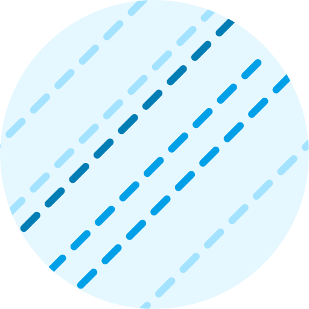

<p align="center">
  
</p>
<h1 align="center">Frap – "Functional Reactive App"</h1>

A Functional Reactive Programming architecture with [xstream](http://staltz.github.io/xstream/), built for React apps used by Lookback's frontend. Heavily inspired by [CycleJS](https://cycle.js.org).

| Variant | Size |
|---------|------|
| frap.js | 60 KB |
| frap.min.js *(minified)* | 20 KB |

## Examples

See `examples` directory for more code. Knowledge of how to program with streams is assumed.

We use:

- **React** as view, but you can use any view library that can draw from a single state object.
- **Typescript**, because we're not insane.

## Install

### Via npm

1. Install frap as a dependency from npm.
2. Require it from within your Typescript or Javascript files:

   ```ts
   import { setup } from 'frap';
   // or
   const { setup } = require('frap');
   ```

### Browser script tag

1. Grab the bundle from the `dist` directory and put in your app's directory structure.
2. Add as a `<script>` tag in your HTML:

   ```html
  <body>
    <!-- stuff -->
    <script src="frap.min.js"></script>
  </body>
   ```
3. The `Frap` namespace is now available in the global scope.

## Develop

```bash
npm install
npm run build # Build Typescript into "build"
npm run bundle # Build example bundle into "dist"
open dist/index.html # Test
```

## To Do

- [x] Working example
- [x] Proper types
- [ ] More examples?
- [ ] More documentation
